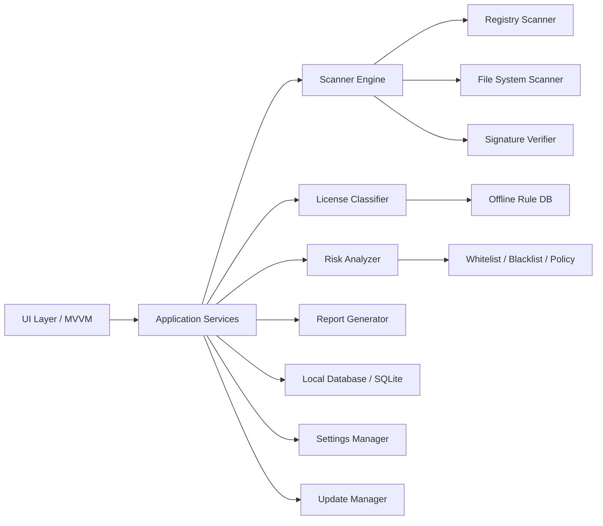

# T-Space License Risk Scanner - Technical Design

Date: 2026-05-14

## A. Phan Tich Yeu Cau San Pham

San pham can giai quyet ba nhom viec: inventory phan mem Windows, phan loai license, va canh bao rui ro tuan thu ban quyen. Doi tuong su dung gom ca nhan, doanh nghiep nho, va IT/SAM team. Vi vay ung dung phai de dung, co bao cao quan tri, va du than trong ve mat phap ly: moi ket qua can la "risk signal", khong phai ket luan chac chan ve crack.

Yeu cau quan trong:

- Quet nguon chinh thong cua Windows: Uninstall Registry HKLM/HKCU, Program Files, AppData, shortcut Start Menu.
- Giu metadata goc de audit: name, publisher, version, install date, paths, website, estimated size, install scope.
- Phan loai license theo confidence, uu tien Unknown khi tin hieu yeu.
- Phat hien dau hieu crack/patch/keygen/KMS/hosts blocking/signature anomaly/service/task bat thuong.
- Dashboard cho IT: tong quan, filter, sort, detail, export.
- Bao cao phuc vu kiem ke va compliance, khong ho tro bypass license.

Gioi han thuc te:

- Windows Registry khong bao gom moi ung dung portable.
- Khong the xac dinh license hop le 100% neu license nam tren cloud account, tenant, dongle, portal vendor, hoac hop dong doanh nghiep.
- Digital signature chi xac minh tinh toan ven file/publisher, khong chung minh license hop le.
- Keyword nhu "patch" co the hop le; vi vay chi la tin hieu can review.

## B. De Xuat Stack Cong Nghe Tot Nhat

### C#/.NET

Khuyen nghi cho ban thuong mai: C# + .NET 10 LTS + WPF hoac WinUI 3, MVVM, SQLite, ClosedXML, QuestPDF, Microsoft.Extensions.DependencyInjection, Serilog.

Neu bat buoc chon trong .NET 8/9:

- .NET 8 LTS: tot hon .NET 9 cho doanh nghiep, nhung can ke hoach nang cap vi ho tro ket thuc thang 11/2026.
- .NET 9 STS: phu hop neu san pham da co ke hoach release nhanh, khong ly tuong cho enterprise LTS.

Theo Microsoft Learn, tai thoi diem tai lieu nay: .NET 10 LTS duoc ho tro den thang 11/2028; .NET 9 STS va .NET 8 LTS duoc ho tro den thang 11/2026.

Uu diem:

- Native Windows integration tot: Registry, Services, Scheduled Tasks, Authenticode, WMI, Event Log.
- UI desktop chuyen nghiep, packaging MSIX/MSI tot, code-signing/auto-update de chuan hoa.
- Strong typing, async, DI, logging, testing ecosystem manh.

Nhuoc diem:

- Can .NET SDK/build pipeline.
- WPF chi tot nhat tren Windows; Avalonia cross-platform nhung ecosystem Windows-native kem hon WPF/WinUI.

### Python

Phu hop cho MVP, internal tool, portable scanner, hoac prototype nhanh: Python + PySide6/PyQt6 + SQLite + pandas/openpyxl + reportlab + pefile + pywin32/winreg.

Uu diem:

- Viet scanner nhanh, de mo rong rule, phu hop automation.
- Portable mode kha de.

Nhuoc diem:

- Packaging desktop chuyen nghiep kho hon, false positive antivirus co the cao hon khi dong goi.
- UI/installer/code-signing/Windows API integration can them thu vien.
- Runtime dependency va performance can quan ly ky.

### Khuyen Nghi

- Thuong mai quoc te: C#/.NET 10 LTS + WPF neu uu tien Windows-native on dinh; WinUI 3 neu muon UI hien dai theo Windows App SDK; Avalonia neu can cross-platform.
- MVP trong repo nay: Python stdlib/Tkinter de chay ngay vi may hien tai chua co dotnet va chua co PySide6/openpyxl/reportlab.

## C. Thiet Ke Kien Truc Tong The



Layering:

- Domain: SoftwareItem, RiskFinding, LicenseRule, ScanSession, PolicyRule.
- Application: scanner orchestration, classification, scoring, report use cases.
- Infrastructure: Registry, filesystem, Authenticode, SQLite, PDF/Excel exporters, updater.
- UI: MVVM view models, dashboard, software list, detail, settings.

Cross-cutting:

- DI for scanners/rules/repository/exporters.
- Structured logging with correlation scan_session_id.
- Error handling per source; scanner should degrade gracefully.
- Unit tests for rules/scoring; integration tests for registry fixtures; UI smoke tests.

## D. Thiet Ke Database SQLite

Core schema implemented in `src/tspace_scan/database.py`.

### scan_sessions

- id INTEGER PK
- started_at TEXT NOT NULL
- completed_at TEXT
- computer_name TEXT
- user_name TEXT
- os_version TEXT
- total_items INTEGER
- total_findings INTEGER
- summary_json TEXT
- Index: implicit PK, optional started_at for history view.

### software_items

- id INTEGER PK
- scan_session_id INTEGER FK -> scan_sessions(id)
- name TEXT NOT NULL
- publisher TEXT
- version TEXT
- install_date TEXT
- install_location TEXT
- executable_path TEXT
- website TEXT
- estimated_size_kb INTEGER
- install_type TEXT
- source TEXT
- registry_key TEXT
- uninstall_string TEXT
- related_paths_json TEXT
- license_files_json TEXT
- license_type TEXT
- license_confidence INTEGER
- license_explanation TEXT
- risk_score INTEGER
- risk_level TEXT
- created_at TEXT
- Index: scan_session_id, name, publisher, license_type, risk_level/risk_score.

### risk_findings

- id INTEGER PK
- software_item_id INTEGER FK -> software_items(id)
- signal TEXT
- reason TEXT
- path TEXT
- level TEXT
- confidence INTEGER
- score_delta INTEGER
- recommendation TEXT
- created_at TEXT
- Index: software_item_id, signal.

### license_rules

- id INTEGER PK
- rule_name TEXT
- match_type TEXT
- pattern TEXT
- license_type TEXT
- confidence INTEGER
- explanation TEXT
- enabled INTEGER
- updated_at TEXT
- Index: enabled, match_type.

### publisher_database

- id INTEGER PK
- publisher_name TEXT UNIQUE
- canonical_name TEXT
- default_license_type TEXT
- website TEXT
- trust_level TEXT
- notes TEXT
- updated_at TEXT

### app_settings

- key TEXT PK
- value TEXT
- updated_at TEXT

### whitelist / blacklist

- id INTEGER PK
- match_type TEXT
- pattern TEXT
- reason TEXT
- created_by TEXT
- created_at TEXT
- blacklist them risk_level TEXT
- Index: match_type, pattern.

## E. Thiet Ke Thuat Toan Quet Phan Mem

1. Quet Registry:
   - HKLM\\Software\\Microsoft\\Windows\\CurrentVersion\\Uninstall
   - HKLM\\Software\\WOW6432Node\\Microsoft\\Windows\\CurrentVersion\\Uninstall
   - HKCU\\Software\\Microsoft\\Windows\\CurrentVersion\\Uninstall
2. Lay DisplayName, Publisher, DisplayVersion, InstallDate, InstallLocation, DisplayIcon, URLInfoAbout, EstimatedSize, UninstallString.
3. Bo qua component he thong nhu SystemComponent, update rollup, child component.
4. Chuan hoa install date, display icon path, install scope.
5. Bo sung filesystem:
   - Program Files, Program Files (x86), LocalAppData, RoamingAppData.
   - Start Menu shortcuts tu ProgramData va user AppData; MVP ghi nhan duong dan shortcut, ban Professional nen resolve `.lnk` target bang COM/Windows API.
   - Tim executable chinh gioi han do sau/file count de tranh scan qua nang.
   - Tim LICENSE/COPYING/EULA/NOTICE.
6. Deduplicate theo name + publisher + version + install_location.
7. Chuyen item qua License Classifier va Risk Analyzer.
8. Luu scan session va item/finding vao SQLite.

## F. Thiet Ke Thuat Toan Phan Loai License

Output:

- license_type: Freeware, Paid software, Trial software, Open-source software, Freemium, Subscription-based, Unknown.
- confidence_score: 0-100.
- explanation: ly do ngan gon, audit duoc.

Tin hieu va diem de xuat:

- User override/enterprise policy: 100.
- Known software offline DB exact/contains match: 70-90.
- Publisher database canonical match: 55-80.
- License file MIT/Apache/GPL/MPL: 80-90.
- EULA/commercial license text: 50-65.
- Name keyword trial/evaluation/community/free: 55-75.
- Website GitHub/GitLab/SourceForge: 55-65.
- Online lookup da verify tu vendor/API: 75-95.
- Tin hieu yeu hon 45: tra ve Unknown.

Pseudo:

```text
candidates = []
add(user_override, 100)
add(known_software_rule)
add(publisher_rule)
add(name_keyword_rule)
add(license_file_rule)
add(website_source_rule)
best = max(candidates by confidence)
if no candidate or best.confidence < 45: Unknown
else best.license_type
```

## G. Thiet Ke Thuat Toan Phat Hien Crack/Rui Ro

Risk score 0-100, khong ket luan tuyet doi.

Tin hieu:

- High keywords: crack, keygen, activator, preactivated, license bypass: +28 moi tin hieu.
- Medium keywords: patch, loader, kms, serial, repack, modified installer: +12 moi tin hieu.
- Hosts file block activation/licensing domain: +30.
- Publisher missing for commercial/trial software: +8.
- Paid/subscription software without local license evidence: +5 voi confidence thap.
- Invalid/missing digital signature for known commercial executable: +10 den +25.
- Suspicious scheduled task/service activation naming: +15 den +35.
- Publisher mismatch between Registry and signature: +25.
- Whitelist: force Low Risk va score 0, nhung van log audit.

Risk level:

- 0-29: Low Risk
- 30-59: Medium Risk
- 60-84: High Risk
- 85-100: Critical Risk

Moi finding can co signal, reason, path, confidence, recommendation. Keyword don le nhu "patch" phai ghi ro co the hop le.

## H. Thiet Ke Giao Dien UI/UX

Views:

- Dashboard: total software, free, paid, trial, open-source, unknown, risk findings.
- Charts: license classification bar chart, risk level bar chart.
- Inventory table: search/filter/sort theo name, publisher, license, risk, install type.
- Detail pane: metadata, license explanation, risk score, findings, related paths.
- Actions: uninstall/open official website/check license/mark safe/export report.
- Settings: scan scope, risk thresholds, offline DB update, proxy/API keys, theme.

Nguyen tac UX:

- Hien thi ket qua theo confidence; tranh ngon ngu ket toi.
- Risk finding phai co "why" va "recommended safe action".
- Mac dinh khong scan sau qua AppData neu khong bat admin/deep scan.
- Export report co executive summary cho IT manager.

Professional prototype da co Tkinter dashboard, charts, search, filters, sort, detail, scan history, compare sessions, whitelist/blacklist, settings, dark mode, log file, digital signature metadata, CSV/JSON/PDF/XLSX export.

## I. Danh Sach Tinh Nang Nang Cao Nen Co

- Scan history va compare 2 lan scan.
- Alert phan mem moi cai / phan mem bi go.
- Trial expiration tracker.
- End-of-life/outdated version detection.
- CVE lookup qua NVD/vendor API.
- Whitelist/blacklist theo enterprise policy.
- License entitlement management, chi luu record hop phap.
- Portable mode va admin scan mode.
- Dark/light theme.
- Offline software database update package co chu ky so.
- Plugin scanner SDK.
- Windows Defender/VirusTotal integration khi co API/key hop le.
- Overall machine compliance risk score.
- Multi-machine collector/report cho SMB.

## J. Roadmap MVP Den Ban Thuong Mai

### Giai doan 1: MVP

- Registry scan.
- Basic filesystem enrichment.
- Basic classification by JSON rules/license files.
- Keyword risk detection.
- SQLite scan session.
- Search/filter/sort UI.
- CSV/JSON export.

### Giai doan 2: Professional

- Professional Python prototype hien da co SQLite repository/migrations, Authenticode signature verification, PDF/Excel report, settings/policy UI, scan history, compare sessions, dark mode, and log file.
- Ban thuong mai nen tiep tuc migrate UI sang C#/.NET, bo sung scheduled tasks/services scanner, installer, code signing, va auto-update.

### Giai doan 3: Enterprise

- Scan history diff.
- Central policy database.
- Offline update channel.
- CVE/EOL intelligence.
- Multi-machine report.
- Role-based access and audit log.
- SIEM/export connectors.

## K. Cau Truc Thu Muc Source Code

```text
data/
  license_rules.json
docs/
  TECHNICAL_DESIGN.md
scripts/
  run.ps1
src/tspace_scan/
  app.py
  database.py
  filesystem_scanner.py
  license_classifier.py
  models.py
  paths.py
  registry_scanner.py
  reports.py
  risk_analyzer.py
  scanner.py
  ui.py
tests/
  test_scoring.py
run_app.py
```

Ban C# thuong mai nen tach:

```text
src/T-SpaceScan.Domain
src/T-SpaceScan.Application
src/T-SpaceScan.Infrastructure.Windows
src/T-SpaceScan.Infrastructure.Persistence
src/T-SpaceScan.Reporting
src/T-SpaceScan.Desktop
tests/T-SpaceScan.Tests
```

## L. Code Mau Cho MVP Chay Duoc

MVP da duoc tao trong repository. Entry point:

```powershell
python .\run_app.py
```

Thanh phan chinh:

- `registry_scanner.py`: doc Uninstall Registry.
- `filesystem_scanner.py`: bo sung executable/license files.
- `license_classifier.py`: confidence-based classification.
- `risk_analyzer.py`: risk scoring.
- `database.py`: SQLite schema/persistence.
- `ui.py`: desktop app.

## M. Huong Dan Build, Chay Va Dong Goi

### Chay local

```powershell
cd C:\Users\hnt\Documents\tspace_scan
python .\run_app.py
```

### Test

```powershell
python -m unittest discover -s tests
python -m compileall src run_app.py tests
```

### Dong goi Python MVP

```powershell
python -m pip install pyinstaller
pyinstaller --noconsole --name TscanLicense .\run_app.py
```

### Dong goi C# ban thuong mai

- Build Release self-contained hoac framework-dependent.
- Sign executable va installer bang certificate doanh nghiep.
- Tao MSI/MSIX bang WiX Toolset, Advanced Installer, hoac MSIX Packaging Tool.
- Bat auto-update voi channel co chu ky so.
- Chay smoke test tren Windows 10/11, standard user va admin.

## N. Luu Y Bao Mat, Phap Ly Va Gioi Han Ky Thuat

- Khong thu thap license key nhay cam neu khong co co che ma hoa, access control, va consent ro rang.
- Khong tao key, bypass activation, patch executable, hoac xoa dau vet crack.
- Khong tu dong xoa file nghi van; chi de xuat hanh dong an toan.
- Scan hosts/services/tasks nen yeu cau admin de day du, nhung phai chay duoc degraded mode khi khong co admin.
- Tat ca online lookup phai co privacy notice, proxy support, cache, va opt-in.
- Report can ghi ro "findings are indicators, not proof".
- Whitelist/blacklist can audit: ai tao, khi nao, ly do.
- Offline rule database nen co version, checksum, va digital signature.

## Sources

- Microsoft Learn, .NET releases and support: https://learn.microsoft.com/en-us/dotnet/core/releases-and-support
- Microsoft Learn, .NET lifecycle: https://learn.microsoft.com/en-us/lifecycle/products/microsoft-net-and-net-core
